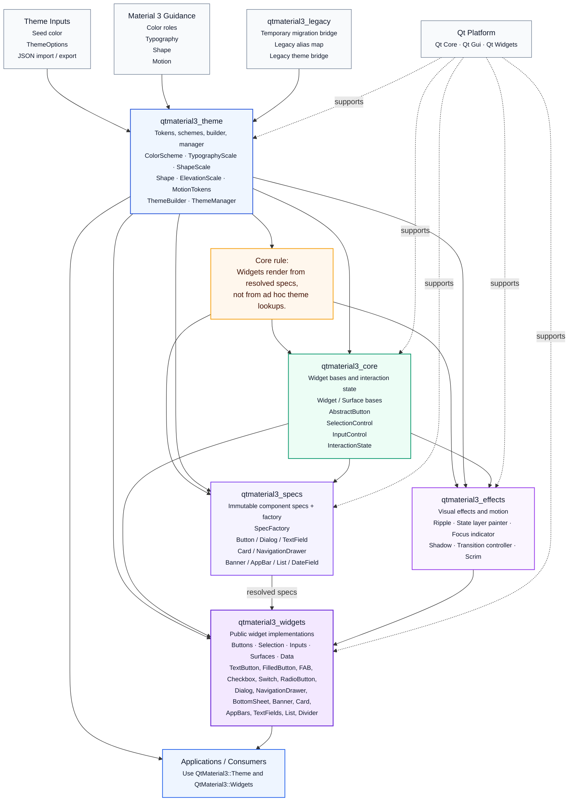
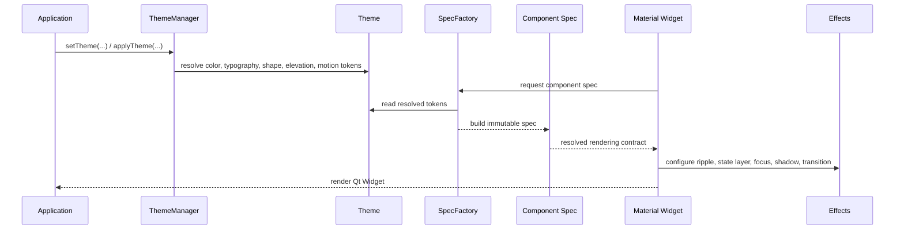

# Architecture overview

`qt-material3-widget` is organized as a layered Qt Widgets framework.

The core rule is:

> Widgets render from resolved specs, not from ad hoc theme lookups.

## Core architecture

## Theme-to-widget flow

